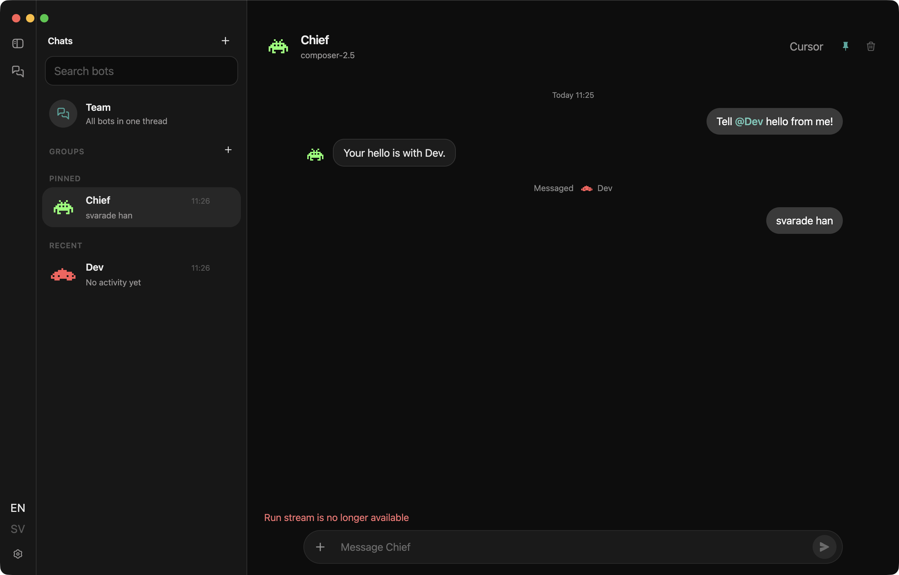
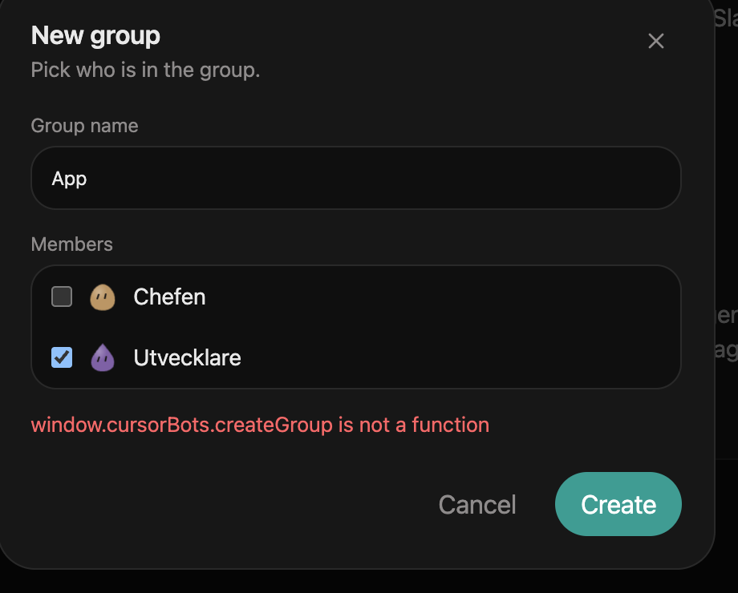
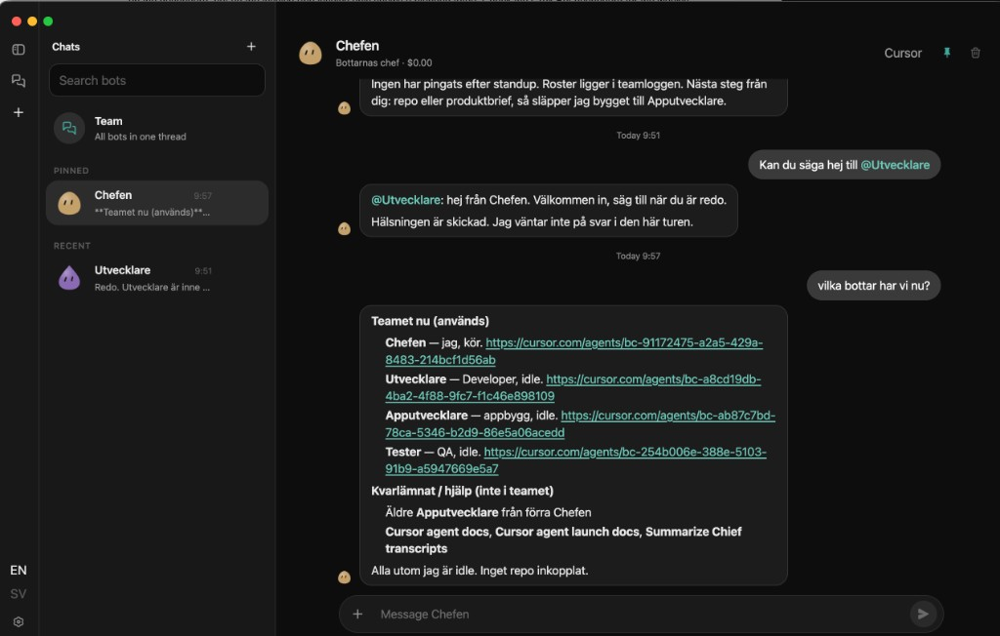

# Cursor Bots

Desktop app with named teammates. Each bot is a [Cursor Cloud Agent](https://cursor.com/docs/cloud-agent). Usage is billed to your **Cursor account**.



Sidebar, team chat, and pixel-art avatars:





## Installation

Download the latest installer from [GitHub Releases](https://github.com/wachtelhund/CursorBot/releases). Pick the file for your machine. GitHub also lists **Source code** zip/tar — that is the repo, not the app.

- **macOS (Apple silicon):** `Cursor-Bots-*-mac-arm64.dmg` — use this on M1/M2/M3/M4
- **macOS (Intel):** `Cursor-Bots-*-mac-x64.dmg`
- **Windows:** `Cursor-Bots-*-win-x64.exe`
- **Linux:** `Cursor-Bots-*-linux-x86_64.AppImage`

**macOS:** open the `.dmg` and drag **Cursor Bots** to Applications.

**Windows:** run the `.exe` installer.

**Linux:** make it executable, then run it:

```bash
chmod +x Cursor-Bots-*-linux-x86_64.AppImage
```

Builds are **unsigned**. On Windows, SmartScreen may warn.

### macOS: “Cursor Bots” is damaged and can’t be opened

The file is not corrupt. Gatekeeper quarantines (`com.apple.quarantine`) an unsigned Electron app downloaded from the internet. *Move to Trash* is the wrong advice.

1. Click **Cancel**. Do **not** move the app to the Trash.
2. In Terminal:

```bash
xattr -cr "/Applications/Cursor Bots.app"
```

3. Open **Cursor Bots** again.

### Phone

Bots are **Cursor Cloud Agents** at `api.cursor.com`. Paste the same API key on the phone. The Mac is not the database, Tailscale is not the product, and the desktop app does not need to stay open.

A browser cannot call `api.cursor.com` directly (CORS).

**Dev:** `npm run dev` binds Vite on the LAN (`server.host: true`). On the phone open `http://<your-computer>:5173`, paste the key. The UI calls `/cursor-api`, which Vite proxies to `https://api.cursor.com`.

**Production CORS:** deploy the tiny proxy, then build the renderer with `VITE_CURSOR_PROXY` set to that origin:

```bash
npx wrangler deploy --config workers/cursor-proxy/wrangler.toml
```

Team send on the phone is `@Name` / `@all` fan-out against Cloud Agents. Groups are not stored in Cursor Cloud.

### Updates

Settings → **Check for updates**, or the **Update to x.y.z** banner, downloads the installer for this machine and installs it. The app restarts when it is done. It does not open GitHub.

The first build that contains this button still has to be installed by hand. After that, later versions install from the button. On macOS the installer strips Gatekeeper quarantine (`xattr`) after it copies the app.

A GitHub Release is created when you push a `v*` tag (e.g. `v0.1.1`) or publish a release. The **Release** workflow can also be run by hand from Actions — then files land as workflow artifacts, not on a GitHub Release.

## Run locally

```bash
npm install
env -u ELECTRON_RUN_AS_NODE npm run dev
npm test
npm run typecheck
```

In the app: gear → paste an API key from [cursor.com/dashboard/api](https://cursor.com/dashboard/api).

`ELECTRON_RUN_AS_NODE` must be unset (`npm run dev` clears it).

## Inspect chats from Cursor (MCP)

This repo includes a small local **stdio MCP** server named `cursor-bots`. The roster lives in Cursor Cloud, not on the Mac. The MCP may still open a leftover `store.json` if one exists from older builds — that file is no longer written and is not the source of truth. It does **not** read `settings.json`, API keys, or token values.

Typical leftover paths (the server picks the newest file that actually has bots or messages):

- Packaged macOS: `~/Library/Application Support/Cursor Bots/store.json`
- `npm run dev` on macOS: `~/Library/Application Support/Electron/store.json` (the binary is still Electron.app)
- Linux: `~/.config/Cursor Bots/store.json` or `~/.config/electron/store.json`
- Windows: `%APPDATA%\Cursor Bots\store.json` or `%APPDATA%\Electron\store.json`

Override with `CURSOR_BOTS_STORE` (file) or `CURSOR_BOTS_USER_DATA` (directory).

Enable it for this workspace via `.cursor/mcp.json` (already in the repo). Reload the Cursor window if the tools do not appear. Run it by hand with `npm run mcp`.

## Team

Open **Team** in the sidebar. A line `@Research do X` or `@Research: do X` wakes that bot. `@all` on its own line wakes everyone. Mid-sentence `@Name` wakes no one.

Bots reach each other the same three ways, each on its own line:

- `@Name: request` — queues the job for after their current run
- `@Name!: request` — interrupts the run they are in, for corrections
- `@Name?: question` — asks; the answer comes back to whoever asked, not to you

Enter **queues** a prompt for after the current Cloud Agent run; several queued messages merge into one run. **Steer** (button or ⌘Enter / Ctrl+Enter) cancels the active run and sends now.

Every bot is woken with the recent thread, who is running right now, and what the original request was — they cannot read the app's threads otherwise. When a wake does not happen (hop limit, a name nobody has), the thread says so instead of going quiet.

GitHub, AWS, and Cloudflare logins happen in Cursor, not here. Shared tokens go under Settings.

## Build

```bash
npm run dist
```

Output lands in `release/`.

## Usage

Runs show up on [cursor.com/dashboard/usage](https://cursor.com/dashboard/usage) under **SDK**, and on [cursor.com/agents](https://cursor.com/agents) with **Source → SDK**.

Icons are adapted from [LibreChat](https://github.com/danny-avila/LibreChat) (MIT). See `THIRD_PARTY.md`.
